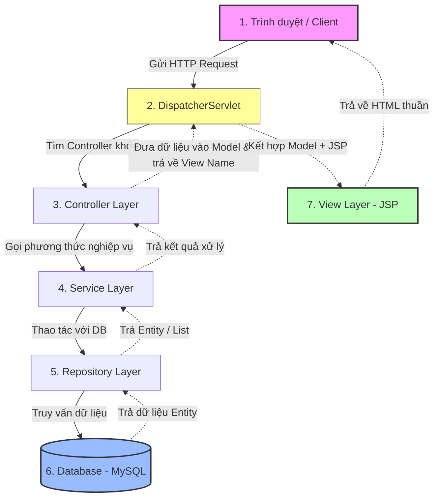

# Hướng Dẫn Onboarding & Tự Học Thêm Chức Năng CRUD User (Spring MVC + JPA)

Chào mừng bạn tham gia phát triển dự án **ZingMP3**! Tài liệu này được biên soạn dành riêng cho các bạn học viên mới bắt đầu tiếp cận với Spring Framework.

Mục tiêu của hướng dẫn này là giúp bạn:
1. **Hiểu rõ luồng xử lý** của một ứng dụng Spring MVC kết hợp Spring Data JPA.
2. **Nắm vững kiến thức cốt lõi** thông qua bản đồ tư duy (Mindmap).
3. **Tự tay triển khai hoàn chỉnh một chức năng CRUD** cho đối tượng `User` qua 5 bước thực hành từ Database lên tới giao diện.

---

## 1. Bản Đồ Tư Duy Ôn Tập Kiến Thức (Spring Ecosystem Mindmap)

Dưới đây là sơ đồ tóm tắt các thành phần chính trong dự án. Bạn có thể sử dụng sơ đồ này để hệ thống hóa kiến thức cần nhớ:

```mermaid
mindmap
  root("Spring MVC + JPA")
    "Cấu Hình (Config)"
      "AppInitializer<br>(Đăng ký Servlet)"
      "AppConfiguration<br>(Cấu hình Bean, JPA, View)"
    "Mô Hình (Model)"
      "Entity (@Entity, @Table)"
      "Primary Key (@Id, @GeneratedValue)"
      "Data Fields"
    "Kho Dữ Liệu (Repository)"
      "Spring Data JPA"
      "JpaRepository<Entity, ID>"
      "Tự động sinh câu lệnh CRUD"
    "Nghiệp Vụ (Service)"
      "Interface (Định nghĩa hành vi)"
      "Implementation (Triển khai logic)"
      "Constructor Injection (Tiêm phụ thuộc)"
    "Điều Hướng (Controller)"
      "Routing (@RequestMapping, @GetMapping, @PostMapping)"
      "Nhận dữ liệu (@ModelAttribute, @PathVariable, Model)"
      "Trả về View name"
    "Giao Diện (View)"
      "HTML thuần"
      "Spring Form Taglib (<form:form>, path)"
      "JSTL Core Taglib (<c:forEach>, <c:if>)"
```

---

## 2. Luồng Đi Của Ứng Dụng (Application Request Flow)

Để phát triển được bất cứ tính năng nào, bạn cần nắm lòng cách một yêu cầu (Request) từ trình duyệt đi qua các lớp như thế nào và cách phản hồi (Response) được trả về:



### Giải thích vai trò của 3 lớp (3-Tier Architecture):
1. **Controller Layer (Tầng điều hướng)**: Tiếp nhận yêu cầu từ client, lấy dữ liệu đầu vào, gọi Service tương ứng để xử lý, sau đó đưa kết quả vào đối tượng `Model` và chỉ định file giao diện JSP nào sẽ hiển thị.
2. **Service Layer (Tầng nghiệp vụ)**: Nơi tập trung toàn bộ logic nghiệp vụ (ví dụ: kiểm tra trùng lặp tài khoản, mã hóa mật khẩu, tính toán...). Tầng này đứng trung gian điều phối giữa Controller và Repository.
3. **Repository Layer (Tầng truy xuất dữ liệu)**: Chịu trách nhiệm giao tiếp trực tiếp với cơ sở dữ liệu. Nhờ có Spring Data JPA, chúng ta chỉ cần khai báo interface kế thừa `JpaRepository` là đã có sẵn các hàm CRUD cơ bản mà không cần viết câu lệnh SQL.

---

## 3. Các Annotation Cốt Lõi Cần Nhớ

| Annotation | Tầng áp dụng | Ý nghĩa & Cách dùng |
| :--- | :--- | :--- |
| **`@Entity`** | Model | Khai báo lớp Java này là một thực thể JPA, ánh xạ trực tiếp với một bảng trong Database. |
| **`@Table`** | Model | Xác định tên bảng cụ thể trong DB (ví dụ: `@Table(name = "users")`). |
| **`@Id`** | Model | Đánh dấu trường thuộc tính làm Khóa chính (Primary Key). |
| **`@GeneratedValue`** | Model | Cấu hình chiến lược tự động sinh khóa chính (ví dụ: `GenerationType.IDENTITY` tương ứng với `AUTO_INCREMENT` trong MySQL). |
| **`@Repository`** | Repository | Đánh dấu lớp/giao diện là tầng Repository để Spring quản lý. |
| **`@Service`** | Service | Đánh dấu lớp là tầng Service, chứa các logic xử lý nghiệp vụ. |
| **`@Controller`** | Controller | Đánh dấu lớp là một Spring MVC Controller để tiếp nhận các request từ client. |
| **`@RequestMapping`** | Controller | Định nghĩa tiền tố URL chung cho cả Controller (ví dụ: `@RequestMapping("/users")`). |
| **`@GetMapping`** | Controller | Đón nhận các HTTP GET request (thường dùng để hiển thị trang giao diện, lấy dữ liệu). |
| **`@PostMapping`** | Controller | Đón nhận các HTTP POST request (thường dùng để gửi dữ liệu từ form lên để lưu/cập nhật). |
| **`@ModelAttribute`** | Controller | Liên kết dữ liệu từ Form ở giao diện trực tiếp vào một đối tượng Java (Form Binding). |
| **`@PathVariable`** | Controller | Trích xuất giá trị động trên đường dẫn URL (ví dụ: `/users/{id}`). |

---

## 4. Tại Sao Nên Dùng Constructor Injection?

Trong Spring Framework, có 3 cách để tiêm sự phụ thuộc (Dependency Injection - DI) vào một Bean:
1. **Field Injection** (Dùng `@Autowired` trực tiếp trên biến thuộc tính):
   ```java
   // Hạn chế dùng cách này
   @Autowired
   private UserRepository userRepository;
   ```
2. **Setter Injection** (Dùng `@Autowired` trên hàm Setter).
3. **Constructor Injection** (Tiêm qua hàm khởi tạo):
   ```java
   // Khuyên dùng (Dự án này đang áp dụng chuẩn này)
   private final UserRepository userRepository;

   public UserServiceImpl(UserRepository userRepository) {
       this.userRepository = userRepository;
   }
   ```

### Lý do dự án ZingMP3 ưu tiên dùng Constructor Injection thay vì `@Autowired`:
* **Tính bất biến (Immutability)**: Các thuộc tính phụ thuộc có thể được khai báo là `final`. Điều này đảm bảo sau khi đối tượng được khởi tạo, các phụ thuộc này không thể bị thay đổi hoặc gán đè bằng `null` tại runtime.
* **Bảo đảm tính toàn vẹn**: Khi bạn tạo mới một đối tượng (ví dụ viết test), constructor bắt buộc bạn phải truyền đầy đủ các đối tượng phụ thuộc vào. Bạn không thể tạo ra một `UserService` ở trạng thái "nửa vời" khi chưa truyền `UserRepository`.
* **Không phụ thuộc vào Spring Container khi viết Unit Test**: Bạn có thể dễ dàng test class Service bằng cách tạo thủ công (`new UserServiceImpl(mockRepository)`) mà không cần nạp toàn bộ cấu hình Spring vốn rất chậm.
* **Phát hiện lỗi phụ thuộc vòng (Circular Dependency) sớm**: Nếu Class A cần Class B, và Class B lại cần Class A qua Constructor, Spring sẽ báo lỗi ngay lập tức khi ứng dụng khởi chạy, thay vì bị lỗi treo hệ thống về sau.

---

## 5. Walkthrough Chi Tiết Từng Bước Thêm Đối Tượng User (CRUD)

Dưới đây là hướng dẫn chi tiết giúp bạn tự tay viết code bổ sung thực thể `User` vào dự án. Hãy tạo các file theo đúng đường dẫn và cấu trúc dưới đây.

---

### Bước 1: Tạo Lớp Thực Thể `User.java` (Model Layer)
Tạo file tại đường dẫn: `src/main/java/vn/codegym/zingmp3/model/User.java`

*Mô tả*: Khai báo bảng `users` trong MySQL. Không sử dụng thư viện Lombok (viết chay Getter/Setter để học viên thực hành khai báo thuộc tính và đóng gói).

```java
package vn.codegym.zingmp3.model;

import jakarta.persistence.*;
import java.util.Date;

@Entity
@Table(name = "users")
public class User {

    @Id
    @GeneratedValue(strategy = GenerationType.IDENTITY)
    private Long id;

    private String username;
    private String password;
    private String email;
    private String role; // ví dụ: ADMIN, USER

    private Date createdAt;
    private Date updatedAt;

    // Constructors
    public User() {
    }

    public User(String username, String password, String email, String role) {
        this.username = username;
        this.password = password;
        this.email = email;
        this.role = role;
    }

    // Getters and Setters
    public Long getId() {
        return id;
    }

    public void setId(Long id) {
        this.id = id;
    }

    public String getUsername() {
        return username;
    }

    public void setUsername(String username) {
        this.username = username;
    }

    public String getPassword() {
        return password;
    }

    public void setPassword(String password) {
        this.password = password;
    }

    public String getEmail() {
        return email;
    }

    public void setEmail(String email) {
        this.email = email;
    }

    public String getRole() {
        return role;
    }

    public void setRole(String role) {
        this.role = role;
    }

    public Date getCreatedAt() {
        return createdAt;
    }

    public void setCreatedAt(Date createdAt) {
        this.createdAt = createdAt;
    }

    public Date getUpdatedAt() {
        return updatedAt;
    }

    public void setUpdatedAt(Date updatedAt) {
        this.updatedAt = updatedAt;
    }

    // Tự động gán ngày tạo khi thêm mới
    @PrePersist
    protected void onCreate() {
        this.createdAt = new Date();
    }

    // Tự động cập nhật ngày sửa khi update
    @PreUpdate
    protected void onUpdate() {
        this.updatedAt = new Date();
    }
}
```

---

### Bước 2: Tạo Interface `UserRepository.java` (Repository Layer)
Tạo file tại đường dẫn: `src/main/java/vn/codegym/zingmp3/repository/UserRepository.java`

*Mô tả*: Chỉ cần kế thừa `JpaRepository` của Spring Data JPA. Spring sẽ tự động sinh mã SQL cho các hàm cơ bản như `findAll()`, `findById()`, `save()`, `deleteById()`.

```java
package vn.codegym.zingmp3.repository;

import org.springframework.data.jpa.repository.JpaRepository;
import org.springframework.stereotype.Repository;
import vn.codegym.zingmp3.model.User;

@Repository
public interface UserRepository extends JpaRepository<User, Long> {
    // Spring Data JPA sẽ tự động tạo các hàm CRUD cơ bản ở đây.
    // Bạn không cần viết thêm dòng code nào nếu chỉ làm CRUD đơn giản.
}
```

---

### Bước 3: Tạo Lớp Nghiệp Vụ `UserService` (Service Layer)
Chúng ta sẽ chia làm 2 file: 1 Interface định nghĩa nghiệp vụ và 1 Class triển khai thực tế.

#### 3.1. Tạo Interface `IUserService.java`
Tạo file tại đường dẫn: `src/main/java/vn/codegym/zingmp3/service/IUserService.java`

```java
package vn.codegym.zingmp3.service;

import vn.codegym.zingmp3.model.User;

public interface IUserService {
    Iterable<User> findAll();
    User findById(Long id);
    void save(User user);
    void remove(Long id);
}
```

#### 3.2. Tạo Class Triển Khai `UserServiceImpl.java`
Tạo file tại đường dẫn: `src/main/java/vn/codegym/zingmp3/service/UserServiceImpl.java`

*Mô tả*: Đánh dấu `@Service` để Spring hiểu và quản lý. Sử dụng **Constructor Injection** để tiêm `UserRepository`.

```java
package vn.codegym.zingmp3.service;

import org.springframework.stereotype.Service;
import vn.codegym.zingmp3.model.User;
import vn.codegym.zingmp3.repository.UserRepository;

@Service
public class UserServiceImpl implements IUserService {

    private final UserRepository userRepository;

    // Tiêm UserRepository thông qua Constructor
    public UserServiceImpl(UserRepository userRepository) {
        this.userRepository = userRepository;
    }

    @Override
    public Iterable<User> findAll() {
        return userRepository.findAll();
    }

    @Override
    public User findById(Long id) {
        return userRepository.findById(id).orElse(null);
    }

    @Override
    public void save(User user) {
        userRepository.save(user); // save vừa dùng để thêm mới (nếu id = null), vừa dùng để cập nhật (nếu id có giá trị)
    }

    @Override
    public void remove(Long id) {
        userRepository.deleteById(id);
    }
}
```

---

### Bước 4: Tạo Bộ Điều Hướng `UserController.java` (Controller Layer)
Tạo file tại đường dẫn: `src/main/java/vn/codegym/zingmp3/controller/UserController.java`

*Mô tả*: Định nghĩa các API để tiếp nhận Request từ trình duyệt, tương tác với `IUserService` và trả về các trang JSP tương ứng.

```java
package vn.codegym.zingmp3.controller;

import org.springframework.stereotype.Controller;
import org.springframework.ui.Model;
import org.springframework.web.bind.annotation.*;
import vn.codegym.zingmp3.model.User;
import vn.codegym.zingmp3.service.IUserService;

@Controller
@RequestMapping("/users")
public class UserController {

    private final IUserService userService;

    // Constructor Injection
    public UserController(IUserService userService) {
        this.userService = userService;
    }

    // 1. Hiển thị danh sách User
    @GetMapping
    public String listUsers(Model model) {
        Iterable<User> users = userService.findAll();
        model.addAttribute("users", users);
        return "user/list"; // Đường dẫn đến file /WEB-INF/views/user/list.jsp
    }

    // 2. Hiển thị form tạo mới User
    @GetMapping("/create")
    public String showCreateForm(Model model) {
        model.addAttribute("user", new User());
        return "user/create";
    }

    // 3. Xử lý lưu User mới
    @PostMapping("/create")
    public String saveUser(@ModelAttribute("user") User user) {
        userService.save(user);
        return "redirect:/users"; // Chuyển hướng trình duyệt quay lại trang danh sách
    }

    // 4. Xem chi tiết User
    @GetMapping("/{id}")
    public String showDetail(@PathVariable("id") Long id, Model model) {
        User user = userService.findById(id);
        model.addAttribute("user", user);
        return "user/detail";
    }

    // 5. Hiển thị form chỉnh sửa User
    @GetMapping("/{id}/edit")
    public String showEditForm(@PathVariable("id") Long id, Model model) {
        User user = userService.findById(id);
        model.addAttribute("user", user);
        return "user/edit";
    }

    // 6. Xử lý cập nhật User
    @PostMapping("/edit")
    public String updateUser(@ModelAttribute("user") User user) {
        userService.save(user); // Hàm save sẽ tự động cập nhật vì User đã có trường ID
        return "redirect:/users";
    }

    // 7. Xóa User
    @GetMapping("/{id}/delete")
    public String deleteUser(@PathVariable("id") Long id) {
        userService.remove(id);
        return "redirect:/users";
    }
}
```

---

### Bước 5: Thiết Kế Giao Diện JSP (View Layer - HTML Thuần)
Hãy tạo thư mục mới: `src/main/webapp/WEB-INF/views/user/` và đặt 4 file JSP dưới đây vào thư mục đó. Giao diện được thiết kế hoàn toàn bằng HTML thuần để bạn tập trung hiểu cách hoạt động của Form Binding và taglib.

#### 5.1. File Giao Diện Danh Sách: `list.jsp`
Đường dẫn: `src/main/webapp/WEB-INF/views/user/list.jsp`

*Mô tả*: Sử dụng thẻ `<c:forEach>` của thư viện JSTL để duyệt qua danh sách User được gửi từ Controller.

```jsp
<%@ page contentType="text/html;charset=UTF-8" language="java" %>
<%@ taglib prefix="c" uri="http://java.sun.com/jsp/jstl/core" %>
<!DOCTYPE html>
<html>
<head>
    <title>Danh sách người dùng</title>
</head>
<body>
    <h1>Danh sách người dùng</h1>
    
    <p>
        <a href="/users/create">Thêm người dùng mới</a> | 
        <a href="/songs">Quản lý bài hát</a>
    </p>

    <c:if test="${empty users}">
        <p>Không có người dùng nào trong hệ thống.</p>
    </c:if>

    <c:if test="${not empty users}">
        <table border="1" cellpadding="10" cellspacing="0">
            <thead>
                <tr>
                    <th>ID</th>
                    <th>Tên đăng nhập</th>
                    <th>Email</th>
                    <th>Vai trò</th>
                    <th>Hành động</th>
                </tr>
            </thead>
            <tbody>
                <c:forEach items="${users}" var="u">
                    <tr>
                        <td>${u.id}</td>
                        <td>${u.username}</td>
                        <td>${u.email}</td>
                        <td>${u.role}</td>
                        <td>
                            <a href="/users/${u.id}">Xem chi tiết</a> | 
                            <a href="/users/${u.id}/edit">Chỉnh sửa</a> | 
                            <a href="/users/${u.id}/delete" onclick="return confirm('Bạn có chắc chắn muốn xóa không?')">Xóa</a>
                        </td>
                    </tr>
                </c:forEach>
            </tbody>
        </table>
    </c:if>
</body>
</html>
```

#### 5.2. Giao Diện Form Thêm Mới: `create.jsp`
Đường dẫn: `src/main/webapp/WEB-INF/views/user/create.jsp`

*Mô tả*: Sử dụng thư viện thẻ form của Spring (`<form:form>`) để tự động đồng bộ (binding) dữ liệu người dùng nhập trực tiếp vào đối tượng `User`.

```jsp
<%@ page contentType="text/html;charset=UTF-8" language="java" %>
<%@ taglib prefix="form" uri="http://www.springframework.org/tags/form" %>
<!DOCTYPE html>
<html>
<head>
    <title>Thêm mới người dùng</title>
</head>
<body>
    <h1>Thêm người dùng mới</h1>
    
    <p><a href="/users">Quay lại danh sách</a></p>

    <!-- modelAttribute "user" phải khớp với tên key add trong Controller -->
    <form:form modelAttribute="user" action="/users/create" method="post">
        <table border="0" cellpadding="5">
            <tr>
                <td>Tên đăng nhập:</td>
                <td><form:input path="username" required="true"/></td>
            </tr>
            <tr>
                <td>Mật khẩu:</td>
                <td><form:password path="password" required="true"/></td>
            </tr>
            <tr>
                <td>Email:</td>
                <td><form:input type="email" path="email" required="true"/></td>
            </tr>
            <tr>
                <td>Vai trò:</td>
                <td>
                    <form:select path="role">
                        <form:option value="USER" label="Người dùng thường"/>
                        <form:option value="ADMIN" label="Quản trị viên"/>
                    </form:select>
                </td>
            </tr>
            <tr>
                <td></td>
                <td><input type="submit" value="Tạo tài khoản"/></td>
            </tr>
        </table>
    </form:form>
</body>
</html>
```

#### 5.3. Giao Diện Form Chỉnh Sửa: `edit.jsp`
Đường dẫn: `src/main/webapp/WEB-INF/views/user/edit.jsp`

*Mô tả*: Rất giống trang `create.jsp` nhưng cần thêm một thẻ `<form:hidden path="id"/>` để lưu lại ID của User cần sửa đổi, giúp Hibernate hiểu đây là hành động cập nhật (Update) thay vì tạo mới.

```jsp
<%@ page contentType="text/html;charset=UTF-8" language="java" %>
<%@ taglib prefix="form" uri="http://www.springframework.org/tags/form" %>
<!DOCTYPE html>
<html>
<head>
    <title>Chỉnh sửa người dùng</title>
</head>
<body>
    <h1>Chỉnh sửa thông tin người dùng</h1>
    
    <p><a href="/users">Quay lại danh sách</a></p>

    <form:form modelAttribute="user" action="/users/edit" method="post">
        <!-- Bắt buộc phải có hidden path="id" để Hibernate biết cần cập nhật bản ghi nào -->
        <form:hidden path="id"/>
        
        <table border="0" cellpadding="5">
            <tr>
                <td>Tên đăng nhập:</td>
                <td><form:input path="username" required="true"/></td>
            </tr>
            <tr>
                <td>Mật khẩu:</td>
                <td><form:password path="password" required="true"/></td>
            </tr>
            <tr>
                <td>Email:</td>
                <td><form:input type="email" path="email" required="true"/></td>
            </tr>
            <tr>
                <td>Vai trò:</td>
                <td>
                    <form:select path="role">
                        <form:option value="USER" label="Người dùng thường"/>
                        <form:option value="ADMIN" label="Quản trị viên"/>
                    </form:select>
                </td>
            </tr>
            <tr>
                <td></td>
                <td><input type="submit" value="Cập nhật"/></td>
            </tr>
        </table>
    </form:form>
</body>
</html>
```

#### 5.4. Giao Diện Xem Chi Tiết: `detail.jsp`
Đường dẫn: `src/main/webapp/WEB-INF/views/user/detail.jsp`

```jsp
<%@ page contentType="text/html;charset=UTF-8" language="java" %>
<%@ taglib prefix="c" uri="http://java.sun.com/jsp/jstl/core" %>
<%@ taglib prefix="fmt" uri="http://java.sun.com/jsp/jstl/fmt" %>
<!DOCTYPE html>
<html>
<head>
    <title>Chi tiết người dùng</title>
</head>
<body>
    <h1>Chi tiết người dùng: ${user.username}</h1>
    
    <p><a href="/users">Quay lại danh sách</a></p>

    <table border="1" cellpadding="10" cellspacing="0">
        <tr>
            <th>Mã người dùng (ID)</th>
            <td>${user.id}</td>
        </tr>
        <tr>
            <th>Tên đăng nhập</th>
            <td>${user.username}</td>
        </tr>
        <tr>
            <th>Email</th>
            <td>${user.email}</td>
        </tr>
        <tr>
            <th>Vai trò</th>
            <td>${user.role}</td>
        </tr>
        <tr>
            <th>Ngày tham gia</th>
            <td><fmt:formatDate value="${user.createdAt}" pattern="dd-MM-yyyy HH:mm:ss"/></td>
        </tr>
    </table>
</body>
</html>
```

---

## 6. Thiết Lập Môi Trường & Chạy Ứng Dụng

Sau khi đã hoàn tất gõ code cho 5 bước trên, học viên thực hiện các bước sau để cấu hình database và khởi động dự án:

### Bước 1: Chuẩn bị Database MySQL
1. Khởi động MySQL Server trên máy tính.
2. Tạo một cơ sở dữ liệu mới tên là `cms` bằng câu lệnh SQL:
   ```sql
   CREATE DATABASE cms;
   ```
3. Mở file [AppConfiguration.java](file:///C:/Users/anhnb/Downloads/zingmp3/src/main/java/vn/codegym/zingmp3/config/AppConfiguration.java) kiểm tra các thông số kết nối Database:
   * Đường dẫn DB (URL): `jdbc:mysql://localhost:3306/cms`
   * Tên đăng nhập (Username): `root`
   * Mật khẩu (Password): nhập mật khẩu MySQL của bạn.
   * Chú ý cấu hình `hibernate.hbm2ddl.auto` đang để là `update`. Nghĩa là khi bạn chạy ứng dụng lần đầu, Hibernate sẽ tự tạo bảng `users` trong MySQL dựa trên khai báo trong `User.java`. Bạn không cần tạo bảng thủ công!

### Bước 2: Build dự án bằng Gradle
Để chạy dự án này trên môi trường local (thông thường thông qua Smart Tomcat trong IntelliJ IDEA hoặc chạy trực tiếp bằng command-line build ra file `.war` đưa vào Tomcat local):
1. Chạy lệnh Gradle để build mã nguồn:
   ```bash
   ./gradlew build
   ```
2. Deploy file `zingmp3-1.0-SNAPSHOT.war` nằm trong thư mục `build/libs/` vào thư mục `webapps` của máy chủ Apache Tomcat 10+.

### Bước 3: Kiểm tra ứng dụng trên trình duyệt
Mở trình duyệt web ưa thích của bạn và truy cập các đường dẫn sau:
* Trang danh sách User: `http://localhost:8080/users`
* Trang thêm mới User: `http://localhost:8080/users/create`
* Trang danh sách bài hát (có sẵn): `http://localhost:8080/songs`
